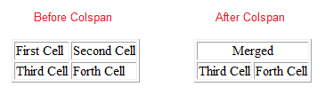
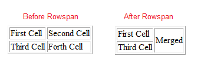
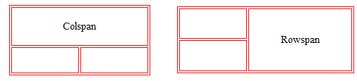

# Tables - Enhanced Definitions


-
-
## Lecture Overview
* A table is divided into rows and each row is divided into cells. There may be a situation where we need the Table Cells span across (or merged) more than one column or row. This is where we use Colspan or Rowspan attributes.
* Colspan
* Rowspan


-
-
### Colspan
* The colspan attribute defines the number of columns a cell should span horizontally
* To span a cell 2 or more cells across:

```HTML
	<table border=1>
		<tr>
			<td colspan=2>Merged</td>
		</tr>
		<tr>
			<td>Third Cell</td>
			<td>Forth Cell</td>
		</tr>
	</table>
```

-
#### Example



-
-
### Rowspan
* The rowspan attribute specifies the number of rows a cell should span vertically.
* To span a cell 2 or more cells vertically:

```HTML
  <table border=1 >
    <tr>
      <td>First Cell</td>
      <td rowspan=2>Merged</td>
    </tr>
    <tr>
      <td valign=middle>Third Cell</td>
    </tr>
  </table>
```

-
#### Example



-
-
### Colspan and Rowspan visual



-
-
## Lecture Summary
* The colspan attribute allows you to horizontally span a cell to or more columns
* The rowspan attribute enables you to vertically span a cell to or more rows
