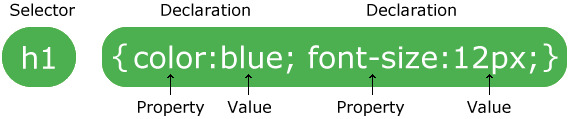

# CSS and Styling


-
-
## Lecture Overview
* What is CSS?
* How to insert CSS
* How CSS is applied
* Styling with Fonts, Color, and Size


-
-
### What is CSS and why do we use it?
* CSS stands for Cascading Style Sheets. They are stored in external CSS files
* CSS describes how HTML elements are to be displayed on screen, paper, or in other media
* CSS saves a lot of work. It can control the layout of multiple web pages all at once


-
-
#### CSS Syntax



* CSS selectors points to the HTML elements you want to style
* A CSS declaration always ends with a semicolon, and declaration blocks are surrounded by curly braces
* A property indicates which stylistic features you want to change. Ex: Font, width, background color
* A value indicated how you want to change the stylistic feature


-
-
#### CSS Selectors
* CSS selectors are used to select HTML elements based on their element name, id, class, attribute, and more


-
-
#### Element Selectors
* The element selector selects elements based on the element name
* The code below selects all `<p>` elements on a page and makes them center aligned and red

```CSS
p {
    text-align: center;
    color: yellow;
}
```

-
-
#### Id Selectors
* The _id selector_ uses the _id attribute_ of an _HTML element_ to select a specific element
* The id of an element should be unique within a page
    * id selector is used to select a single HTML element
* Use a hash `#` followed by the id of the element

```CSS
#headshot {
    background: green;
    border: 1px solid red;
}
```


-
-
#### Class Selectors
* The _class selector_ selects elements with a specific class attribute
* Use a period `.` character, followed by the name of the class
* Can appear multiple times within a page, unlike id selectors which only appear once

```CSS
.projects {
    text-align: center;
}
```


-
-
#### Grouping Selectors
* If you have multiple elements with the same style, you can group the selectors with a comma
* This helps to minimize code

```CSS
h1, h2, p {
    text-align: center;
    color: red;
}
```


-
-
#### Descendant Selectors
* _Descendant_ selectors (or _descendant combinator_) allow you to combine two or more selectors so you can be more specific
* Elements matched by the second selector are selected if they have an _ancestor element_ matching the first selector
* This relationship is created with a space between selectors

```CSS
ul li {
    margin: 10px;
}
```


-
-
### How to insert CSS
There are three ways to insert CSS
* External Style Sheet
* Internal Style Sheet
* Inline style


-
-
#### External Style Sheet
* Able to change the look of a page with just one file
* Each page must include a reference to the external style sheet file inside the `<link>` element. The `<link>` element goes inside the `<head>` section
* The style sheet file must be saved with a .css extension.
* Easy to maintain and saves time

```HTML
<head>
    <link rel="stylesheet" type="text/css" href="mystyle.css">
</head>
```

-
-
#### Internal Style Sheet
* An internal stylesheet holds the CSS code for the webpage in the `<head>` section of the particular file
* Only affects the page the code is inserted into
* Not reusable

```HTML
<head>
    <style>
        body { background-color: blue; }
        p { color: white; }
    </style>
</head>
```

-
-
#### Inline Style
* The inline style is added as an HTML attribute
* Good for an individual CSS change that you do not use repeatedly throughout the site
* This is not a recommended approach

```HTML
<h1 style="font-size: 48px;">My headline</h1>
```


-
-
### How CSS is applied
* There are a few rules that determine how styles are applied to your HTML
* They all work together and can be combined in interesting ways


-
-
#### Cascading
* Styles are read from top to bottom in the stylesheet
* The lowest style "wins"

```CSS
p {
  color: red;
  font-weight: bold;
  font-size: 18px;
}

p {
  color: blue;
}
```

```HTML
<p>I’m blue, 18px, and bold.</p>
```


-
-
#### Inheritance
* Some styles are passed from parent to children

```CSS
p {
  color: red;
  font-weight: bold;
  font-size: 18px;
}

span {
  font-style: italic;
}
```

```HTML
<p>I’m red, 18px, and bold.
  <span>I am those and also italic.</span>
</p>
```

-
-
#### CSS Specificity
* If two CSS selectors apply to the same element, the one with higher specificity wins
* There are 4 categories which define the specificity level of a selector
* Each category has a certain number of points
[](./specificity-chart.png)


-
-
#### Inline styles
* An inline style is directly attached to the element that is styled
* Has a value of 1000 points

```HTML
<h1 style="color: #ffffff;">
```

-
-
#### IDs
* An unique identifier for the page elements using `#`
* Has a value of 100 points

```CSS
#headshot {
    background: green;
    border: 1px solid red;
}
```

-
-
#### Classes, attributes, and pseudo-classes
* This category includes `.classes`, `[attributes]` and _pseudo-classes_ such as `:hover`, `:focus` etc.

```CSS
.project{
    font-family: Tahoma;
    font color: #4F0E42;
}
```

```CSS
a:hover{
    color: purple;
}
```

-
-
#### Elements and pseudo-elements
* This includes element names and _pseudo-elements_, such as `h1`, `div`, `:before` and `:after`.
* Has a value of 1 point

```CSS
h2{
    font-family: Comic Sans, sans-serif;
    font color: #DFAEB4;
}
```

-
-
#### Specificity Chart


-
-
### CSS Styling with Fonts, Size, and Colors
* Various fonts, sizes, and colors can be used through CSS to style your HTML web page


-
-
#### Font-family
* `font-family` property assigns a font to the specified element(s)
* `font-family` property _can_ hold several font names as a "fallback" system.
    * If the browser does not support the first font, it tries the next font.
* Property _should_ hold several font names as a fallback system if the browser does not support the first font.

```CSS
body {
    /* A font family name and a generic family name */
    font-family: "Arial", sans-serif;
    font-family: "Times New Roman", serif;

    /* A generic family name */
    font-family: serif;
}
```

#### Difference Between Serif and Sans-serif


-
-
#### Font-Size
* `font-size` sets the size of the font
* `12px` - `14px` is recommended for the body text accessibility

```CSS
p {
    /* <length> values */
    font-size: 12px;

    /* <percentage> values */
    font-size: 80%;
}
```

-
-
#### Font
* The `font` property is shorthand for `font-style`, `font-variant`, `font-weight`, `font-size`, and `font-family`
* Shorthand properties allow you to set multiple values with one declaration

```CSS
p {
  font: italic bold 12px "Arial", sans-serif;
}
```


-
-
#### Color
* The `color` property is used to set the color of the text
* Colors in CSS can be specified using
  * a color name - `red`
  * a HEX value - `#ff0000`
  * an RGB or RGBA value - `rgb(255)`

```CSS
p {color: red;}
```


-
-
#### Background-Color
* The `background-color` property changes the color of the Background

```CSS
p {
    background-color: black;
    background-color: #000000;
    background-color: rgba(0,0,0);
}
```


-
-
#### Text-Align
* The `text-align` property is used to set the horizontal alignment of a text
* Text can be `left`, `right`, `centered`, `justify` alignment
* When the `text-align` property is set to `justify`, each line is stretched so that every line has equal width and the left and right margins are straight.
* Similar to magazines and newspapers

```CSS
h1 {
    text-align: center;
}

p {
    text-align: left;
}

.right {
    text-align: right;
}

div {
    text-align: justify;
}
```

-
-
### A list of all the CSS properties
* https://css-tricks.com/almanac/properties/
