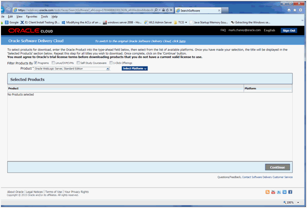
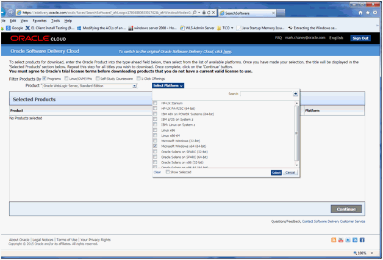

# WebLogic Server Installation

-
-
## Overview
1. Create Oracle Software Delivery Cloud Account
2. Navigate To Oracle Software Delivery Cloud
2. Search and Find Product
3. Install the WebLogic Server Binary
4. Search and find product `WebLogic Server, Standard Edition`
5. 

-
## Create Oracle Software Delivery Cloud Account
Click [here](https://profile.oracle.com/myprofile/account/create-account.jspx?pid=edelivery&nexturl=https%3A//edelivery.oracle.com/osdc/faces/Home.jspx) or navigate to the link below to create an Oracle Software Delivery Cloud Account
  * `https://profile.oracle.com/myprofile/account/create-account.jspx?pid=edelivery&nexturl=https%3A//edelivery.oracle.com/osdc/faces/Home.jspx`

-
## Navigate To Oracle Software Delivery Cloud
* Click [here](https://edelivery.oracle.com) or navigate to the link below to access the Delivery Cloud
  * `https://edelivery.oracle.com`
* Review the site usage license agreement and click the Accept button to continue.

-
## Search and Find Product
* In Oracle Software Delivery Cloud, in the Filter Products By list of checkboxes, be sure Programs is checked.
* In the Product field, enter this string:
  * `Oracle WebLogic Server, Standard Edition`

-
-
### Topic 1
* Sub-topic 1A
* Sub-topic 1B
* Sub-topic 1C

-
#### Sub-topic 1A
* Discussion point 1A.1
* Discussion point 1A.2
* Discussion point 1A.3

-
#### Sub-topic 1B
* Discussion point 1B.1
* Discussion point 1B.2
* Discussion point 1B.3

-
#### Sub-topic 1C
* Discussion point 1C.1
* Discussion point 1C.2
* Discussion point 1C.3

-
-
### Topic 2
* Sub-topic 2A
* Sub-topic 2B
* Sub-topic 2C

-
#### Sub-topic 2A
* Discussion point 2A.1
* Discussion point 2A.2
* Discussion point 2A.3

-
#### Sub-topic 2B
* Discussion point 2B.1
* Discussion point 2B.2
* Discussion point 2B.3

-
#### Sub-topic 2C
* Discussion point 2C.1
* Discussion point 2C.2
* Discussion point 2C.3

-
-
### Topic 3
* Sub-topic 3A
* Sub-topic 3B
* Sub-topic 3C

-
#### Sub-topic 3A
* Discussion point 3A.1
* Discussion point 3A.2
* Discussion point 3A.3

-
#### Sub-topic 3B
* Discussion point 3B.1
* Discussion point 3B.2
* Discussion point 3B.3

-
#### Sub-topic 3C
* Discussion point 3C.1
* Discussion point 3C.2
* Discussion point 3C.3

-
-
## Lecture Summary
* Topic 1 Summary
* Topic 2 Summary
* Topic 3 Summary
