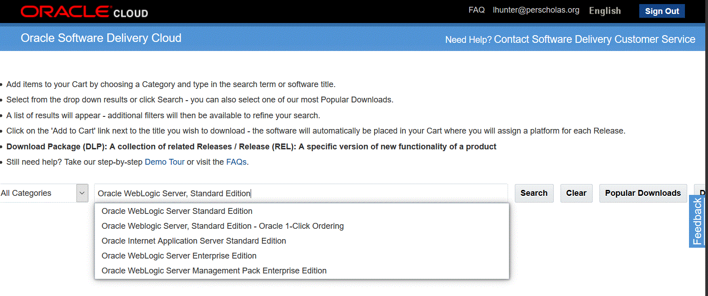
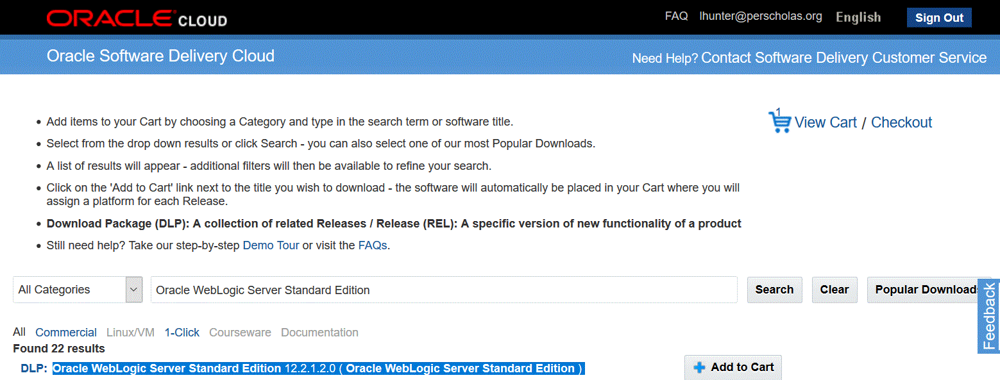

# WebLogic Server Installation

-
-
## Overview
* Obtaining The Executable
* Installing The Executable

-
### Obtaining Binary
1. Create Oracle Software Delivery Cloud Account
2. Navigate To Oracle Software Delivery Cloud
3. Search and Find Product
4. Select Product
5. Select Edition
6. Select Release
7. License Agreement
8. Download

-
#### 1. Create Oracle Software Delivery Cloud Account
* Click [here](https://profile.oracle.com/myprofile/account/create-account.jspx?pid=edelivery&nexturl=https%3A//edelivery.oracle.com/osdc/faces/Home.jspx) or navigate to the link below to create an Oracle Software Delivery Cloud Account
  * `https://profile.oracle.com/myprofile/account/create-account.jspx?pid=edelivery&nexturl=https%3A//edelivery.oracle.com/osdc/faces/Home.jspx`

-
#### 2. Navigate To Oracle Software Delivery Cloud
* Click [here](https://edelivery.oracle.com) or navigate to the link below to access the Delivery Cloud
  * `https://edelivery.oracle.com`
* Review the site usage license agreement and click the Accept button to continue.

-
#### 3. Search and Find Product
* In Oracle Software Delivery Cloud, in the Filter Products By list of checkboxes, be sure Programs is checked.
* In the Product field, enter this string:
  * `Oracle WebLogic Server, Standard Edition`

-
#### 4. Select Product
* On Oracle Software Delivery Cloud, in the `Select Products` pulldown, select this checkbox:
  * `Microsoft Windows x64 (64-bit)`
* Click the `Continue` button

-
#### 5. Select Edition
* Expand the entry Oracle WebLogic Server Standard Edition by clicking the arrow to the left of the release name.
* Click the Continue button.

-
#### 6. Select Release
* For Available Release, turn off all the checkboxes except for the version of the Oracle WebLogic Server that is listed in the Oracle Certifications for use with the JD Edwards EnterpriseOne Development Client.

* Click the Continue button.

-
#### 7. License Agreement
* On Oracle Standard Terms and Restrictions, read the license agreement, click the checkbox if you accept, and click the Continue button.

-
#### 8. Download
* On the File Download screen, click the link for the Oracle WebLogic Server.
* Save the downloaded file to your computer.
* Extract the contents of the downloaded file.
* For WebLogic Server 12.2.1 the download should consist of this file or a similar version number:
    * `fmw_12.2.1.0.0_wls.jar`

-
#### 8. Download

-
-
### Installing The Executable

-
#### Identify JDK Bin location
* Execute `which java` from a _bash_ terminal to identify where the jdk has been installed.
* In the example below, the `bin` fullpath is `/c/Program Files/Amazon Corretto/jdk1.8.0_222/bin`

-
#### Run the `WebLogic Server 12.2.1.jar`
* From the java `bin` directory, execute the cli argument below
* `java -jar <path_to_wls_file>\fmw_12.1.3.0.0_wls.jar`