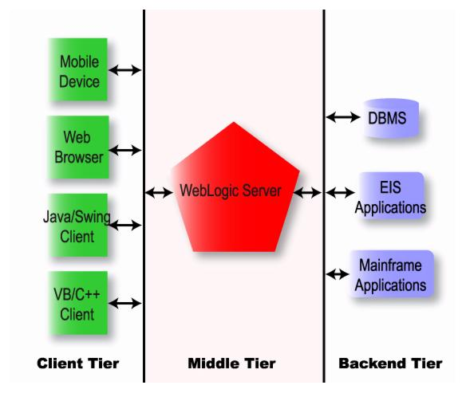

# WebLogic Server Architecture

-
#### Software Component Tiers
* The software components of a multitier architecture consist of three tiers:
  1. The client tier 
  2. The middle tier 
  3. The backend tier 

-
####  Software Component Tiers
##### The Client Tier
* contains programs executed by users, including Web browsers and network-capable application programs.
* These programs can be written in virtually any programming language.

* WebLogic Server clients use standard interfaces to access WebLogic Server services.
* WebLogic Server has complete Web server functionality, so a Web browser can request pages from WebLogic Server using the Web's standard HTTP protocol.
* WebLogic Server servlets and JavaServer Pages (JSPs) produce the dynamic, personalized Web pages required for advanced e-commerce Web applications.

* Client programs written in Java may include highly interactive graphical user interfaces built with Java Swing classes.
* They can also access WebLogic Server services using standard J2EE APIs.

* All these services are also available to Web browser clients by deploying servlets and JSP pages in WebLogic Server.

* CORBA-enabled client programs written in Visual Basic, C++, Java, and other programming languages can execute WebLogic Server Enterprise JavaBeans and RMI (Remote Method * Invocation) classes using WebLogic RMI-IIOP.
* Client applications written in any language with support for the HTTP protocol can access any WebLogic Server service through a servlet.

-
####  Software Component Tiers
##### The Middle Tier
* contains WebLogic Server and other servers that are addressed directly by clients, such as existing Web servers or proxy servers.

* The middle tier includes WebLogic Server and other Web servers, firewalls, and proxy servers that mediate traffic between clients and WebLogic Server. The Nokia WAP server, part of the BEA mobile commerce solution, is an example of another middle tier server that provides connectivity between wireless devices and WebLogic Server.

* Applications based on a multitier architecture require reliability, scalability, and high performance in the middle tier. The application server you select for the middle tier is, therefore, critical to the success of your system.

* The WebLogic Server cluster option allows you to distribute client requests and back-end services among multiple cooperating WebLogic Servers. Programs in the client tier access the cluster as if it were a single WebLogic Server. As the workload increases, you can add WebLogic Servers to the cluster to share the work. The cluster uses a selectable load-balancing algorithm to choose a WebLogic Server in the cluster that is capable of handling the request.

* When a request fails, another WebLogic Server that provides the requested service can take over. Failover is transparent whenever possible, which minimizes the amount of code that must be written to recover from failures. For example, servlet session state can be replicated on a secondary WebLogic Server so that if the WebLogic Server that is handling a request fails, the client's session can resume uninterrupted on the secondary server. WebLogic EJB, JMS, JDBC, and RMI services are all implemented with clustering capabilities. 

-
#### The Backend Tier
##### Part 1 - What is it?
* contains services that are accessible to clients only through WebLogic Server.
* backend applications tend to be the most valuable and mission-critical enterprise resources.
* WebLogic Server protects them by restricting direct access by end users.

-
#### The Backend Tier
##### Part 2 - What does it include?
* Backend services include
  * databases
  * enterprise resource planning (ERP) systems
  * mainframe application
  * legacy enterprise applications

-
#### The Backend Tier
##### Part 3
* Existing enterprise applications can be integrated into the backend tier using the Java Connector Architecture (JCA) specification from Sun Microsystems.
* WebLogic Server makes it easy to add a Web interface to an integrated backend application.

* A database management system is the most common backend service, required by nearly all WebLogic Server applications.
* WebLogic EJB and WebLogic JMS typically store persistent data in a database in the backend tier.

* A JDBC connection pool, defined in WebLogic Server, opens a predefined number of database connections.
* Once opened, database connections are shared by all WebLogic Server applications that need database access.
* The expensive overhead associated with establishing a connection is incurred only once for each connection in the pool, instead of once per client request.
* WebLogic Server monitors database connections, refreshing them as needed and ensuring reliable database services for applications.

* WebLogic Enterprise Connectivity, which provides access to BEA WebLogic EnterpriseTM systems, and Jolt® for WebLogic Server, which provides access to BEA Tuxedo® systems, also use connection pools to enhance system performance. 